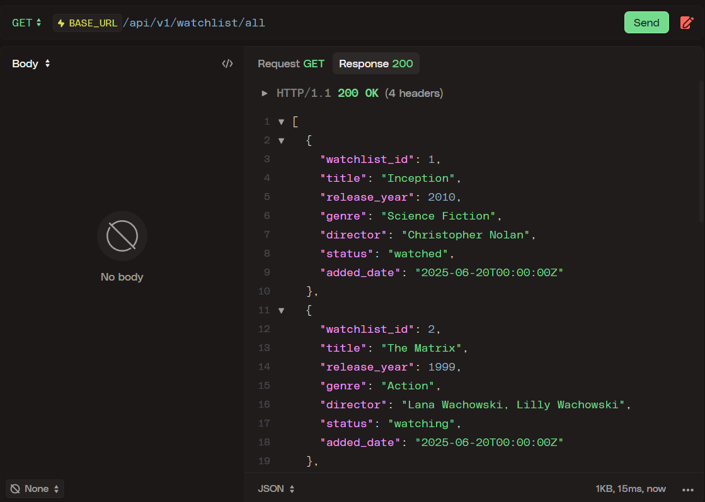
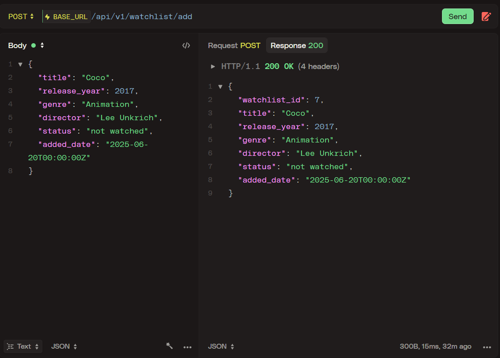
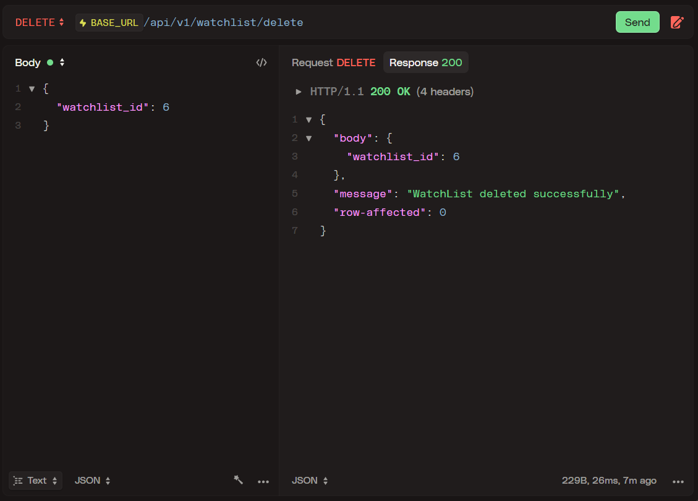
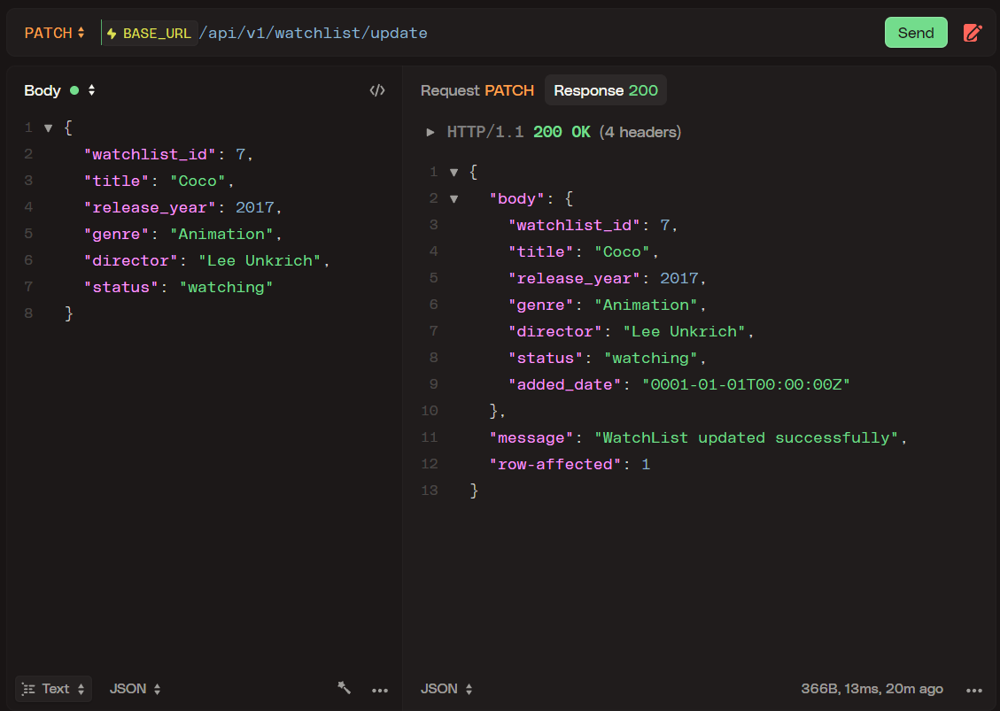

<h1 align="center">CineDots</h1>


<div align="center">
  <!--  -->
  
  <!-- <br> -->
  
  
</div>

<br>

> ### Track your movie watchlist...

A simple movie watchlist tracker backend built using the Gin framework and SQLite as the database.

## :computer: Tech Stack
- [**Go**](https://go.dev/) : Programming language
- [**Gin**](https://github.com/gin-gonic/gin) : Web framework
- [**SQLite3**](https://github.com/mattn/go-sqlite3) : A sqlite3 database driver

<br>

## :book: How to Use / Run on Your Machine

- ### Prerequisites:
    - Install Go (version >= 1.23.3): https://golang.org/dl/
    - API Testing Tool
      - [Postman](https://www.postman.com/downloads/)
      - [Httpie](https://httpie.io/download)

> I am using [**HttPie**](https://httpie.io/download) for API testing
> you can use any tool as per your requirement
> and `curl` is fine too :D

> [!IMPORTANT]  
> I am using WSL (Ubuntu).

<br>

### :toolbox: Setup Project Locally:

- Clone the repository:
```sh
git clone https://github.com/saketv8/cine-dots.git
```

- Navigate to the project directory:
```sh
cd cine-dots
```

- Install dependencies:
```sh
go mod download
```
- Generate Database with some default data:

> [!IMPORTANT]
>
> `OPTIONAL STEP` as I have already included the `cine_dots.db`
>
>  delete the `cine_dots.db` in `DB/cine_dots.db` and use below command to generate new one

```sh
go run migrations/migration.go
```

- Building the Application Binary:
```sh
go build
```

> :rocket: You're all set! Now you have `cine-dots` binary

<br>

### :bookmark_tabs: Available REST API End Points

| Method   | Endpoint                                             | Description                     |
|----------|-----------------------------------------------------|---------------------------------|
| **GET**  | `http://localhost:9090/api/v1/watchlist/watched`                         | Get watched items               |
| **GET**  | `http://localhost:9090/api/v1/watchlist/watching`                        | Get currently watching items    |
| **GET**  | `http://localhost:9090/api/v1/watchlist/all`                             | Get all items in the watchlist  |
| **GET**  | `http://localhost:9090/api/v1/watchlist/notwatched`                      | Get items not yet watched       |
| **GET**  | `http://localhost:9090/api/v1/watchlist/:watchlist_id`                   | Get details of a specific watchlist by ID |
| **POST** | `http://localhost:9090/api/v1/watchlist/add`                             | Add a new item to the watchlist |
| **DELETE** | `http://localhost:9090/api/v1/watchlist/delete`                        | Delete an item from the watchlist |
| **PATCH** | `http://localhost:9090/api/v1/watchlist/update`                         | Update an item in the watchlist |

<br>

### :satellite: Open the Postman/Httpie and Make Request

<div align="center">
    
    
</div>

<div align="center">
    
    
</div>

<br>

### :jigsaw: Usage Examples

> [!IMPORTANT]  
> Add these json value as body while making request

#### 🐻‍❄️ POST (Add New WatchList)

body of the request
```json
{
  "title": "Coco",
  "release_year": 2017,
  "genre": "Animation",
  "director": "Lee Unkrich",
  "status": "not watched",
  "added_date": "2025-06-20T00:00:00Z"
}
```

#### 🐳 DELETE (Delete WatchList by ID)

body of the request
```json
{
  "watchlist_id": 6
}
```

#### 🐦‍🔥 PATCH (Update WatchLList by ID)

body of the request
```json
{
  "watchlist_id": 7,
  "title": "Coco",
  "release_year": 2017,
  "genre": "Animation",
  "director": "Lee Unkrich",
  "status": "watching"
}
```

<br>

## :seedling: Todo / Future Improvements
- [x] Show All WatchList
- [x] Get Particular WatchList By ID
- [x] Add New WatchList Data
- [x] Delete WatchList Data
- [x] Update WatchList Data
- [ ] Web Application for this API (NextJS/Vite-React)

## :compass: About
This project was created as an assignment for Session 2 of Keploy's API Fellowship.